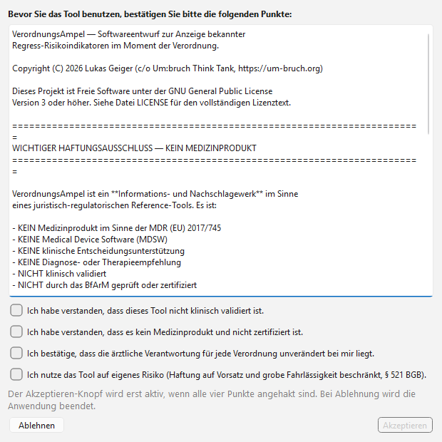

# VerordnungsAmpel

> **Softwareentwurf** zum strukturierten Abgleich ärztlicher Verordnungen
> mit öffentlich dokumentierten Regelwerken (AM-RL Anlagen III/V/VI,
> PRISCUS 2.0, Praxisbesonderheiten-Listen). Zu Forschungs- und
> Weiterentwicklungszwecken veröffentlicht — ohne jegliche Gewähr.
>
> **Software draft** for structured comparison of prescriptions with
> publicly documented regulatory rule-sets (German statutory health-
> insurance context). Released for research and further development
> by stakeholders in the healthcare system — without any warranty.

> ⚠️ **Rechtlicher Hinweis / Legal Notice**
>
> Dieses Projekt ist ein **Softwareentwurf**, der **bekannte** Regress-
> Risikoindikatoren aus öffentlichen Regelwerken zur Anzeige bringt —
> nicht mehr. Er ist:
>
> - **Kein Medizinprodukt** im Sinne der MDR (EU) 2017/745
> - **Keine Regress-Prävention** — Regresse werden durch das Tool
>   weder verhindert noch mit Wirksamkeit versprochen
> - **Kein klinisches Entscheidungsunterstützungssystem**
> - **Nicht klinisch validiert**, nicht durch BfArM oder eine Benannte
>   Stelle geprüft, nicht zertifiziert
> - **Ohne Validitätsprüfung** der Regelwerkseinträge durch medizinische
>   Fachgesellschaften
> - **Ohne** Wartungsvertrag, Support-Versprechen oder
>   Verfügbarkeitszusage
>
> Zweckbestimmung: **Risikoindikatoren-Anzeige zu Forschungszwecken**,
> freigegeben zur Weiterentwicklung durch Akteure des Gesundheitswesens
> (Ärzteverbände, Forschungsgruppen, Pilotprojekte). Die ärztliche
> Verantwortung für jede Verordnung bleibt unverändert und
> uneingeschränkt (§ 76 SGB V, § 630a BGB).
>
> Unentgeltliche Open-Source-Schenkung gemäß §§ 516 ff. BGB. Haftung
> auf Vorsatz und grobe Fahrlässigkeit beschränkt (§ 521 BGB, GPL-3.0
> §§ 15/16). Nutzung ausschließlich auf eigenes Risiko.

**Status:** Pre-Alpha v0.1.0 — CLI-MVP funktional, PySide6-Tray-GUI in Entwicklung
**Lizenz / License:** GPL-3.0-or-later
**Repository:** https://github.com/research-line/verordnungsampel
**GitHub-Sichtbarkeit / Visibility:** Public repository; lokale Datenbanken, Logs,
Build-Artefakte und interne Steuerungsdateien bleiben per `.gitignore` lokal.

---

## Deutsch

### Was es ist

Ein **Softwareentwurf**, der die Kombination aus **ICD-10-GM-Code** und
**ATC-Code** gegen **bekannte öffentliche Regelwerke** (AM-RL Anlagen III/V/VI,
PRISCUS 2.0) abgleicht und farbige Risikoindikatoren (grün/gelb/rot) ausgibt —
mit Quellenverweis und nachvollziehbarem Audit-Trail. Zweckbestimmung:
Forschung, Lehre, Weiterentwicklung durch Akteure des Gesundheitswesens.

**Was es ausdrücklich NICHT ist:**
- Kein Praxisverwaltungssystem
- Kein Medical Device Software (MDSW) im Sinne der MDR
- **Keine Regress-Prävention** — das Tool verhindert keine Regresse und
  verspricht keine Wirkung
- Keine klinische Entscheidungsunterstützung
- Keine Therapie- oder Diagnoseempfehlung
- Keine Patientendatenverarbeitung
- **Nicht klinisch validiert** — die Regelwerkseinträge wurden von
  medizinischen Fachgesellschaften nicht geprüft

### Warum

- **47 %** der deutschen Hausärzte ändern ihr Verordnungsverhalten aus Regressangst
  (Ribbat et al. 2023, n ≈ 800)
- **75 %** der Praxen würden ihr aktuelles PVS *nicht* weiterempfehlen
  (Zi-Studie 2024, 10 245 Bewertungen)
- Drei kritische Funktionslücken in allen kommerziellen PVS:
  1. Strukturierte Begründungspflicht im Moment der Verordnung
  2. Bundesweite Praxisbesonderheiten-Erkennung
  3. Manipulationssicherer Compliance-Log mit Beweiskraft vor Sozialgericht

### Funktionen (alle 5 im MVP umgesetzt)

| # | Funktion | Status |
|---|---|---|
| 1 | Echtzeit-Plausibilitätsprüfung (Ampel gegen AM-RL III/V/VI, PRISCUS 2.0) | ✅ |
| 2 | Strukturierte Begründungspflicht als Hierarchical State Machine (BSG-konform) | ✅ |
| 3 | Vorab-Klärungs-Workflow container-sensitiv (Pflicht / Verboten / Stellungnahme) | ✅ |
| 4 | Praxisbesonderheiten-Erkennung + Quartalsreminder | ✅ |
| 5 | Manipulationssicherer Compliance-Log (Hash-Chain) | ✅ |

Test-Suite: **86 / 86 passed**.

### Schnellstart

```bash
# Installation (Source)
git clone https://github.com/research-line/verordnungsampel.git
cd verordnungsampel
pip install -r requirements.txt
pip install -e .

# Datenbank initialisieren (+ Seed-Daten laden)
python -m verordnungsampel.cli.main init

# Beispiele
python -m verordnungsampel.cli.main check --icd I10   --atc C09AA02              # GRÜN
python -m verordnungsampel.cli.main check --icd M54.5 --atc A02BC02              # GELB
python -m verordnungsampel.cli.main check --icd F41   --atc N05BA01  --alter 72  # ROT

# Strukturierte Begründung (HSM, interaktiv)
python -m verordnungsampel.cli.main justify --icd F41 --atc N05BA01 --alter 72

# Vorab-Antrag generieren
python -m verordnungsampel.cli.main workflow --icd R52.1 --atc QV12 \
    --kk "Musterkasse" --praxis "Musterpraxis" \
    --arzt "Dr. med. Musterarzt" --patient P-4711 --out antrag.txt

# Quartalsreminder
python -m verordnungsampel.cli.main remind --quartal 2026-Q2

# Compliance-Log
python -m verordnungsampel.cli.main log
python -m verordnungsampel.cli.main verify
```

Unter Windows: Doppelklick auf `start.bat` öffnet ein interaktives Demo-Menü.

### GUI (PySide6-Tray-Modus)

Das Tool kann als Tray-Anwendung neben dem PVS laufen (Companion-Modus):

```bash
pip install -e ".[gui]"
python -m verordnungsampel.cli.main gui
```

Das Hauptfenster ist kompakt, lässt sich per Klick auf „X“ ins System-Tray minimieren
und wird erst über **Rechtsklick auf das Tray-Icon → Beenden** wirklich geschlossen.
Always-on-top, Minimal-Modus und Transparenz-Optionen sind verfügbar.

Für einen lokalen Windows-Build liegt `build_exe.bat` im Projektwurzelverzeichnis.
Das Skript erzeugt `dist/VerordnungsAmpel/VerordnungsAmpel.exe`; `build/`, `dist/`,
`releases/` und `*.exe` bleiben lokale Release-Artefakte und werden nicht versioniert.
Der Einstiegspunkt `verordnungsampel_gui.py` hält den Build ohne absolute lokale Pfade
reproduzierbar.

### Screenshot



### Architektur

| Komponente | Wahl |
|---|---|
| CLI-Kern | Python-Stdlib (sqlite3, hashlib, argparse) |
| GUI | PySide6 (LGPL, Qt Company) |
| Datenbank | SQLite, lokal in `%APPDATA%\VerordnungsAmpel\regelwerk.db` |
| Regelwerke | AM-RL Anlagen III / V / VI als JSON-Seed (`data/seed/`) |
| Compliance-Log | Hash-Chain, versiegelt Ampel-Ergebnis + Begründung + Workflow |

### Dokumentation

- [`KONZEPT.md`](KONZEPT.md) — Vollständiges Projektkonzept
- [`CHANGELOG.md`](CHANGELOG.md) — Versionshistorie
- [`docs/MARKTVERGLEICH.md`](docs/MARKTVERGLEICH.md) — Markt- und Abgrenzungsanalyse
- [`docs/legal/GESAMTEINSCHAETZUNG.md`](docs/legal/GESAMTEINSCHAETZUNG.md) — Öffentliche rechtliche Kurzbewertung
- [`docs/RESOURCES_DIAGNOSTIC_PAPER.md`](docs/RESOURCES_DIAGNOSTIC_PAPER.md) — Pattern-Quellen (Geiger 2026)
- [`docs/legal/RECHTSGUTACHTEN_MDSW.md`](docs/legal/RECHTSGUTACHTEN_MDSW.md) — Erstgutachten „Informationswerk vs. MDSW"
- [`docs/legal/DSGVO_KONZEPT.md`](docs/legal/DSGVO_KONZEPT.md) — Datenschutz-Konzept

### Beziehung zu Um:bruch / Regress-Melder

- **PP-003** (Um:bruch) = anonyme Meldeplattform für bereits geschehene Regresse
- **ST-001** (Um:bruch) = wissenschaftliche Begleitstudie zum Regress-System
  https://github.com/research-line/regressangst
- **VerordnungsAmpel** (dieses Projekt) = Softwareentwurf zur Anzeige bekannter
  Regress-Risikoindikatoren vor der Verordnung

### Mitwirken

Beiträge sind willkommen — insbesondere Aktualisierungen der AM-RL-Regelwerke und
neue Rechtsprechung. Siehe [`CONTRIBUTING.md`](CONTRIBUTING.md) (DCO-Signoff nötig).

### Haftungshinweis

Die VerordnungsAmpel ist ein **Informations- und Nachschlagewerk**. Sie ersetzt nicht
die ärztliche Prüfung im Einzelfall und stellt keine Rechtsberatung dar. Alle Entscheidungen
liegen bei der Ärztin / dem Arzt.

---

## English

### What it is

An open-source software draft for German outpatient care contexts. It can run alongside
the practice-management system (PVS) and, at the moment of prescribing, checks the
combination of **ICD-10-GM code** and **ATC code** against public rule sets. Output:
a traffic light (green / yellow / red) with justification, source reference, and a
tamper-proof audit trail.

**What it is not:** not a practice-management system, not a medical device, not clinical
decision support, no patient data processing, and no promise of recoupment prevention.
Pure plausibility checking against public rule sets.

### Why

- **47 %** of German GPs alter their prescribing behaviour out of fear of economic-efficiency
  review recoupments (Ribbat et al. 2023)
- **75 %** of practices would *not* recommend their current PVS (Zi 2024)
- Three critical functional gaps in all commercial PVS: structured rationale capture at
  time of prescription, nationwide practice-specifics detection, and a tamper-proof
  compliance log with evidentiary weight in social court proceedings.

### Features (all 5 MVP functions shipped)

1. Real-time plausibility check (traffic light against AM-RL annexes III / V / VI, PRISCUS 2.0)
2. Structured rationale capture as a Hierarchical State Machine (compliant with BSG case law)
3. Container-sensitive prior-clarification workflow (mandatory / forbidden / opinion-request)
4. Practice-specifics detection + quarterly reminder
5. Tamper-proof compliance log (hash chain)

Test suite: **86 / 86 passed**.

### Quick Start

```bash
git clone https://github.com/research-line/verordnungsampel.git
cd verordnungsampel
pip install -r requirements.txt
pip install -e .
python -m verordnungsampel.cli.main init
python -m verordnungsampel.cli.main check --icd I10 --atc C09AA02
```

### GUI (PySide6 tray mode)

```bash
pip install -e ".[gui]"
python -m verordnungsampel.cli.main gui
```

The main window is compact and, on clicking "X", minimises to the system tray. It is
only fully terminated by **right-clicking the tray icon → Quit**.

For a local Windows desktop build, use `build_exe.bat` from the project root.
It creates `dist/VerordnungsAmpel/VerordnungsAmpel.exe`; `build/`, `dist/`,
`releases/`, and `*.exe` remain local release artifacts and stay out of Git.
The `verordnungsampel_gui.py` entry point keeps the build reproducible without
absolute local paths.

### Screenshot


### Relationship to Um:bruch / Regress-Melder

- **PP-003** — anonymous reporting platform concept for past recoupments
- **ST-001** — scientific companion study — https://github.com/research-line/regressangst
- **VerordnungsAmpel** — this project — **software draft** displaying recoupment-risk indicators from public rule-sets, released for research and further development (no warranty, no clinical validation, no claim of actual prevention)

### Disclaimer

VerordnungsAmpel is an **information / reference tool**. It does not replace medical
judgement in individual cases and does not constitute legal advice. All decisions remain
with the practising physician.

---

*Project home: https://um-bruch.org*
